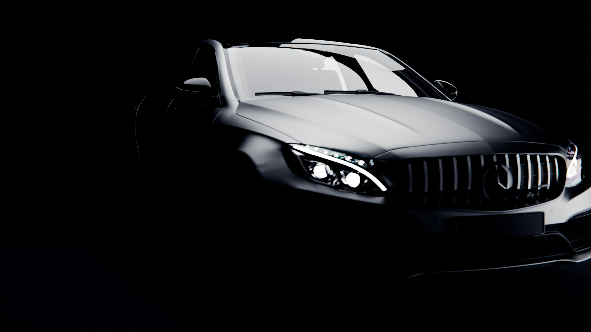

# Mercedes C63 Advertisement

## Project Overview

This project showcases a high-quality 3D advertisement for the Mercedes C63, created using Blender. The animation features stunning camera work, lighting, and animation to highlight the vehicle's design.

## Features

- **Model**: A detailed and realistic 3D model of the Mercedes C63.
- **Camera Work**: Dynamic and engaging camera angles that showcase the car's aesthetics.
- **Lighting**: Professional lighting setups that enhance the car's features and create a cinematic atmosphere.
- **Animation**: Smooth and captivating animations that bring the car to life.

## Authors

- **3D Model**: The Mercedes C63 model was created by [JeanYan](https://www.jeanyanonline.com/c63). The model captures the essence and intricate details of the vehicle, making it the centerpiece of the advertisement.
- **Camera Work, Lighting, and Animation**: The camera work, lighting, and animation were expertly crafted by [Utkarsh MIshra](https://utkarsh-creates.github.io/). This includes setting up dynamic shots, creating realistic lighting scenarios, and animating the vehicle to showcase its features.

## Tools and Software

- **Blender**: The project was entirely created and rendered using Blender, an open-source 3D creation suite.
- **Post-Production**: [Adobe Premier Pro](https://www.adobe.com/in/products/premiere.html).

## Acknowledgments

- A big thank you to [JeanYan](https://www.jeanyanonline.com/c63) for creating the amazing Mercedes C63 model.
